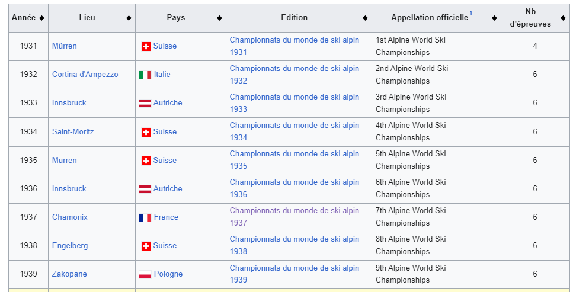

# Légende
## Enoncé
> Sur cette photo, une des premières légendes du ski français s'apprête à franchir la ligne d'arrivée et remporter son troisième titre de champion du monde cette année. Saurez-vous retrouver son nom et prénom ainsi que le nom de la ville dans laquelle ces compétitions ont eu lieu ?

> **Format du flag:** 404CTF{jean-michel-dupont_tokyo}

Auteur: **@Izipak (_hdrien)**

## State of the art

Nous recherchons:
- Un Homme
- Française
- Champion du monde 3 fois en ski
- La ville Française dans laquelle elle a été couronnée pour la troisième fois

## Recherche des compétitions potentielles

En se rendant sur [Wikipedia](https://fr.wikipedia.org/wiki/Championnats_du_monde_de_ski_alpin) on peut facilement voir l'historique des championnes du monde de Ski.

    

En se rendant sur le premier championnat du monde de ski alpin organisé en France (à Chamonix) on apprendre Emile Allais a été sacré sur trois disciplines: Descente, Slalom et Combiné lors de la même compétition.

Flag: **404CTF{emile-allais_chamonix}**