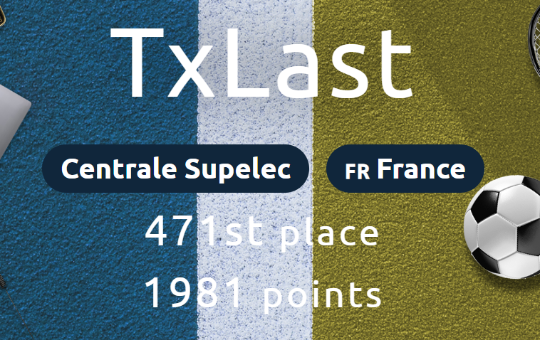
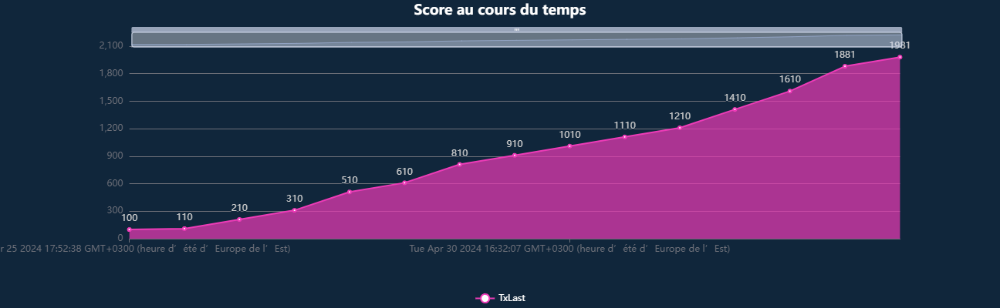
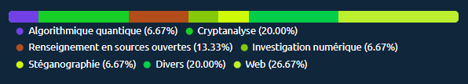

# 404CTF 2024

Challenge [404CTF](https://www.404ctf.fr/) organisé par Télécom SudParis et la DGSE.

Je suis arrivé 471e (sur 3271) avec 1981 points.

## Épreuves par catégorie

## Divers

| Épreuve | Points | Résolu |
|:-------:|:------:|:------:|
| Discord | 10 | :white_check_mark: |
| De la friture sur la ligne | 100 | :white_check_mark: |
| Bienvenue | 100 | :white_check_mark: |
| Revers(ibl)e Engineering [0/2] | 905 | :x: |

## Cryptanalyse

| Épreuve | Points | Résolu |
|:-------:|:------:|:------:|
| Bébé nageur | 100 | :white_check_mark: |
| Le petit bain | 200 | :white_check_mark: |
| Poor Random Number Generator [1/2] | 271 | :white_check_mark: |
| Plongeon Rapide Super Artistique | 708 | :x: |
| J'éponge donc j'essuie | 891 | :x: |
| Poor Random Number Generator [2/2] | 956 | :x: |
| Zack Adeaux | 967 | :x: |
| La Seine | 968 | :x: |
| J'ai glissé chef ! | 996 | :x: |
| SEA - La face cachée de l'Iceberg | 999 | :x: |
| La Brasse ou Le Papillon ? | 1000 | :x: |
| RSAlade-tomatECC-oigNPon | 1000 | :x: |

## Exploitation de binaires

| Épreuve | Points | Résolu |
|:-------:|:------:|:------:|
| Pseudoverflow | 100 | :x: |
| Jean Pile | 824 | :x: |
| Mordu du 100m | 908 | :x: |
| Antismash | 993 | :x: |

## Web

| Épreuve | Points | Résolu |
|:-------:|:------:|:------:|
| Vous êtes en RETARD | 100 | :white_check_mark: |
| Le match du siècle [1/2] | 100 | :white_check_mark: |
| Le match du siècle [2/2] | 200 | :white_check_mark: |
| Exploit mag | 200 | :white_check_mark: |
| LE GORFOU 42 | 620 | :x: |
| La Boutique Officielle | 998 | :x: |

## Investigation numérique

| Épreuve | Points | Résolu |
|:-------:|:------:|:------:|
| Le tir aux logs  | 100 | :white_check_mark: |
| Un boulevard pour pointer | 100 | :x: |
| Darts Bank | 200 | :x: |
| Coup de circuit [1/3] | 200 | :x: |
| Vaut mieux sécuriser que guérir | 741 | :x: |
| De bons croissants au beurre | 988 | :x: |
| Poids Raw vs. Cours Jette [1/3] | 988 | :x: |

## Sécurité matérielle

| Épreuve | Points | Résolu |
|:-------:|:------:|:------:|
| Serial killer | 100 | :x: |
| Le soulevé de GND | 402 | :x: |
| Comment est votre modulation ? [1/2] | 849 | :x: |
| Comment est votre modulation ? [2/2] | 944 | :x: |
| Sea side channel [1/4] - Introduction | 950 | :x: |
| Sea side channel [2/4] - Reconnaissance | 999 | :x: |
| Sea side channel [3/4] - Mais où sont les triggers ? | 1000 | :x: |

## Stéganographie

| Épreuve | Points | Résolu |
|:-------:|:------:|:------:|
| L'absence | 100 | :white_check_mark: |
| Regarder en stéréo | 200 | :x: |
| Le grand écart | 879 | :x: |
| La chute | 946 | :x: |
| La Barre Fixe | 992 | :x: |

## Rétro-Ingénierie

| Épreuve | Points | Résolu |
|:-------:|:------:|:------:|
| Échauffement | 100 | :x: |
| Intronisation du CHAUSSURE | 200 | :x: |
| Bugdroid Fight [1/2] | 200 | :x: |
| Revers(ibl)e Engineering [1/2] | 703 | :x: |
| Nanocombattants | 956 | :x: |
| Revers(ibl)e Engineering [2/2] | 972 | :x: |
| Le Tableau Noir | 1000 | :x: |
| L'entrée du Dojo | 1000 | :x: |

## Renseignement en sources ouvertes

| Épreuve | Points | Résolu |
|:-------:|:------:|:------:|
| Légende | 100 | :white_check_mark: |
| Not on my watch | 200 | :white_check_mark: |
| Secret Training [1/2] | 776 | :x: |
| That Escalated Quickly | 838 | :x: |

## Algorithmique quantique

| Épreuve | Points | Résolu |
|:-------:|:------:|:------:|
| Des trains superposés  | 100 | :white_check_mark: |
| De l'écoute, pas très discrète | 958 | :x: |
| De la multiplicité des problèmes | 975 | :x: |
| De l'inversion | 996 | :x: |

## Intelligence artificielle

| Épreuve | Points | Résolu |
|:-------:|:------:|:------:|
| Du poison [1/2] | 100 | :x: |
| Du poison [2/2] | 352 | :x: |
| Des portes dérobées | 894 | :x: |
| Du poison [3/2] | 958 | :x: |

**Source code** des challenges: https://github.com/HackademINT/404CTF-2024
