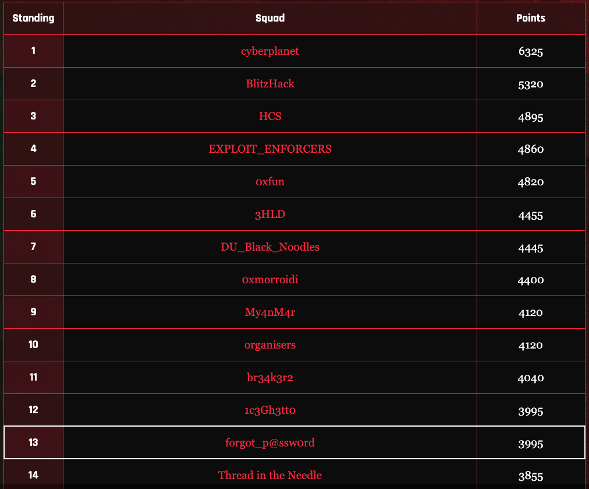
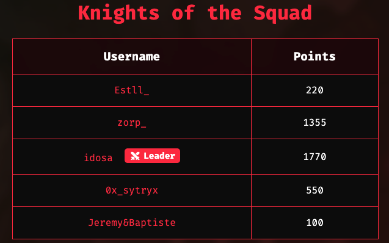
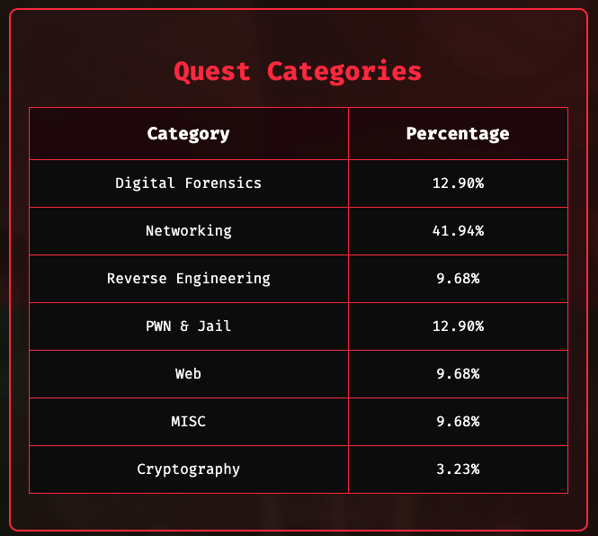

# BDSec CTF 2025

On July 20–21, 2025, I participated in **BDSec CTF 2025** with my intern team **forgot_p@ssw0rd**.

This repository contains detailed write-ups and notes for the challenges we tackled throughout the competition. Our aim was to learn, collaborate, and push our skills in various cybersecurity domains.

👉 Scoreboard: [https://2025.bdsec-ctf.com/scoreboard](https://2025.bdsec-ctf.com/scoreboard)

## Write-ups

Below are some of the write-ups we documented. Each contains step-by-step explanations, techniques, and insights gained during the challenge resolution:

- [Small Jail Portal](./WriteUps/Small_Jail_Portal.md)
- ...

_(More write-ups will be added here as they are completed.)_

## Challenge Summary

Our team was composed of the following members:

We solved challenges across a wide range of categories including Digital Forensics, Networking, Reverse Engineering, Web, PWN & Jail, Cryptography, and Miscellaneous. Some categories had more points and were more challenging, but our team worked effectively to secure solutions and gain valuable experience.

Below is a comprehensive overview of our challenge completions, ordered by completion time and category for unsolved ones:

| Quest Title | Category | Points | Solver | Solved At |
|-------------|----------|--------|-----------|--------|
| Hosts | Networking | 50 | idosa | 2025-07-20 17:14:58 |
| Ports | Networking | 50 | idosa | 2025-07-20 17:19:21 |
| Router | Networking | 50 | idosa | 2025-07-20 17:25:59 |
| RiddleMe | MISC | 50 | 0x_sytryx | 2025-07-20 17:33:18 |
| Minar ’52 Enigma | Reverse Engineering | 100 | idosa | 2025-07-20 18:16:23 |
| KShackZone’s Phishing Breach Investigation | Digital Forensics | 0 | 0x_sytryx | 2025-07-20 19:01:20 |
| Yeti Killer | Web | 100 | 0x_sytryx | 2025-07-20 19:21:45 |
| Riddle of The Child and the Thirteenth | MISC | 50 | 0x_sytryx | 2025-07-20 19:29:25 |
| Poisoned Ledger hex | Digital Forensics | 50 | 0x_sytryx | 2025-07-20 19:37:43 |
| revME | Reverse Engineering | 70 | Estll_ | 2025-07-20 20:50:53 |
| Quantum Mirage | Cryptography | 100 | zorp_ | 2025-07-20 20:52:47 |
| Enumeration | Networking | 50 | 0x_sytryx | 2025-07-20 21:09:50 |
| Creadentials | Networking | 50 | 0x_sytryx | 2025-07-20 21:22:07 |
| Version | Networking | 100 | 0x_sytryx | 2025-07-20 21:45:07 |
| CVE | Networking | 50 | 0x_sytryx | 2025-07-20 21:46:21 |
| Evil File reader | Web | 50 | Estll_ | 2025-07-20 22:31:14 |
| The Promise Was Not True | MISC | 50 | Estll_ | 2025-07-20 22:41:23 |
| Special Access | Web | 50 | 0x_sytryx | 2025-07-21 00:23:59 |
| Small Jail Portal | PWN & Jail | 315 | zorp_ | 2025-07-21 10:16:01 |
| FileName & Param  | Networking | 50 | Estll_ | 2025-07-21 10:37:24 |
| Woody’s Hidden Trigger | PWN & Jail | 100 | zorp_ | 2025-07-21 10:51:58 |
| Buzz’s Memory Mission | PWN & Jail | 100 | zorp_ | 2025-07-21 11:07:00 |
| Rex’s Counter Crisis | PWN & Jail | 50 | zorp_ | 2025-07-21 11:18:32 |
| Hacker App | Reverse Engineering | 100 | Jeremy&Baptiste | 2025-07-21 11:21:06 |
| Key to Execution | Networking | 160 | zorp_ | 2025-07-21 14:38:23 |
| User Name | Networking | 315 | idosa | 2025-07-21 15:10:16 |
| Shell | Networking | 390 | idosa | 2025-07-21 15:15:35 |
| Binary | Networking | 405 | idosa | 2025-07-21 15:20:17 |
| File Name | Networking | 410 | idosa | 2025-07-21 15:21:19 |
| Phishing Trail | Digital Forensics | 205 | zorp_ | 2025-07-21 16:37:36 |
| Hidden in Plain Sight | Digital Forensics | 335 | zorp_ | 2025-07-21 16:48:57 |
| Time Based Caesar | Cryptography | 500 |  |  |
| Chant of the Drones | Digital Forensics | 460 |  |  |
| Command and Control | Digital Forensics | 490 |  |  |
| Crack the Credentials | Digital Forensics | 405 |  |  |
| False Patches | Digital Forensics | 490 |  |  |
| Shadow Movement | Digital Forensics | 485 |  |  |
| TasmotaHack | Reverse Engineering | 450 |  |  |

---

Feel free to explore our repository to dive into how we approached each challenge, and to learn from our notes and solutions.
