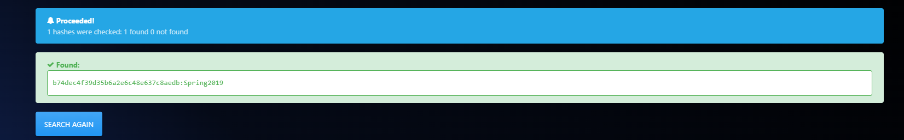

# Android CTF - CTFLearn Basic Android RE 1

Welcome to the Android Capture The Flag (CTF) based on the CTFLearn Basic Android RE 1 application!

## Introduction

This CTF is an open source challenge published by jonp, more informations [here](https://ctflearn.com/challenge/962).

## Prerequisites

- Linux
- The Android application BasicAndroidRE1.apk downloaded from github

## Walkthrough

The first things to do are to decode the app and search for flag strings:
```
apktool decode BasicAndroidRE1.apk
```

```
strings BasicAndroidRE1.apk > strings.txt
```

We get a convincing result, now we know we have to search for a password.
```
$grep -r flag strings.txt 
00Welcome, please enter the password for the flag!
..welcome_please_enter_the_password_for_the_flag
```

Using now grep on all res files recursively:
```
┌─[✗]─[zorp@parrot]─[~/Desktop/BasicAndroidRE/BasicAndroidRE1/res]
└──╼ $grep -r password
```

We find two interesting ids:
```
values/public.xml:    <public type="string" name="password" id="0x7f0b0029" />
values/public.xml:    <public type="string" name="welcome_please_enter_the_password_for_the_flag" id="0x7f0b002d" />
```

Let's now look for the source code:
```
d2j-dex2jar BasicAndroidRE1.apk -o BasicAndroidDecoded.jar
java -jar jd-gui-1.6.6.jar
```

In MainActivity.class we find the following function:
```java
public void submitPassword(View paramView) {
    EditText editText = (EditText)findViewById(2131165239);
    if (DigestUtils.md5Hex(editText.getText().toString()).equalsIgnoreCase("b74dec4f39d35b6a2e6c48e637c8aedb")) {
      TextView textView = (TextView)findViewById(2131165322);
      StringBuilder stringBuilder = new StringBuilder();
      stringBuilder.append("Success! CTFlearn{");
      stringBuilder.append(editText.getText().toString());
      stringBuilder.append("_is_not_secure!}");
      textView.setText(stringBuilder.toString());
    } 
  }
```
Using hashes.com we can dehash this and find that the hash is equal to `Spring2019`.



According to the function the flag should be the following: (confirmed by CTFLearn validation)

Flag: **CTFlearn{Spring2019_is_not_secure!}**

## Video

[Walkthrought video of my work](https://youtu.be/9MLDOSXXmFY).