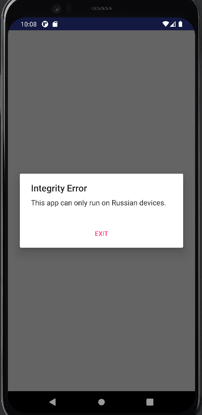
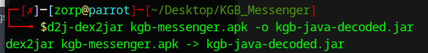
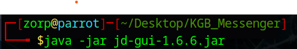
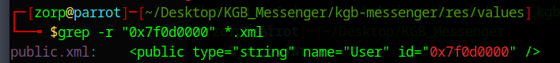
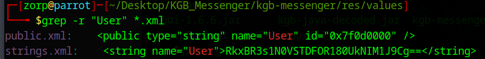
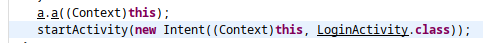
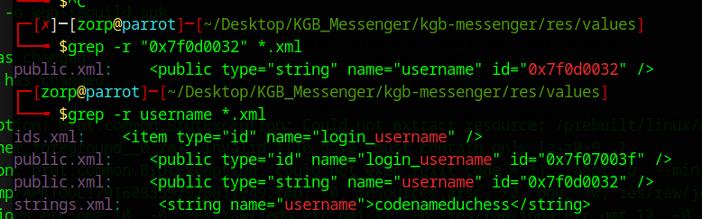
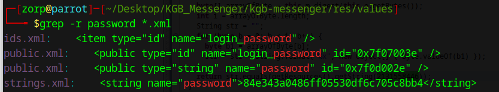

# Android CTF - KGB Messenger

Welcome to the Android Capture The Flag (CTF) based on the KGB Messenger application!

## Introduction

This CTF is an open source challenge published by tlamb96, source code [here](https://github.com/tlamb96/kgb_messenger/tree/master).

## Prerequisites

- Android Studio
- The Android application kgb-messenger.apk downloaded from github

## Walkthrough

The strings technique doesn't give us any information for now so let's start running the app.

We directly encounter this message:



After changing the mobile language nothing changes, let's start working on the app.

Unzip the .apk file:

```
apktool decode kgb-messenger.apk
```

In decoded `AndroidManifest.xml` we can see 3 activities: `MainAcitivity` `MessengerActivity` & `LoginActivity`, we may try to know which one launches the first.

We now want to see the source code of this app, to do so we will use `d2j-dex2jar` in the `.apk` file, then read the resulting `.jar` file using `jd-gui`.





We now have access to the app source code.

Like the first function to be launched in an app is OnCreate, we take a look at it on `MainActivity.class` file:

```java
  protected void onCreate(Bundle paramBundle) {
    super.onCreate(paramBundle);
    setContentView(2131296284);
    String str2 = System.getProperty("user.home");
    String str1 = System.getenv("USER");
    if (str2 == null || str2.isEmpty() || !str2.equals("Russia")) {
      a("Integrity Error", "This app can only run on Russian devices.");
      return;
    } 
    if (str1 == null || str1.isEmpty() || !str1.equals(getResources().getString(2131558400))) {
      a("Integrity Error", "Must be on the user whitelist.");
      return;
    } 
    a.a((Context)this);
    startActivity(new Intent((Context)this, LoginActivity.class));
  }
```

To start the activity we need both strings `str2` & `str1` to follow these conditions: 
- `str1` & `str2` are not empty/null
- `str2 != "Russia"`
- `str1 != getResources().getString(2131558400)`

We should find the value of this string in `strings.xml` but in hex format.

Using tools like Python or [RapidTables](https://www.rapidtables.com/convert/number/decimal-to-hex.html), we find that the string we are looking for is **0x7f0d0000**.

Going to res/values and using a grep on all .xml files, we find that this string appears in `public.xml`.



This value is an id linked to a name `User`, by going a little deeper through this item, we find a base64 sequence: RkxBR3s1N0VSTDFOR180UkNIM1J9Cg==, CyberChef tells us that is was a flag!




Flag1: **FLAG{57ERL1NG_4RCH3R}**

What we will want to do now is rebuild the app but without the check for both our strings, and directly launch `startActivity` function.

After removing all the if conditions is the smali file of the start activity we are able to rebuild the app:

```
apktool b kgb-messenger -o kgb-rebuild.apk
```


We are stuck here as we don't know any username/password couple.

Now, what we may want to do is look where `startActivity` brings us, and especialy to the login page.


```java
public void onLogin(View paramView) {
    EditText editText1 = (EditText)findViewById(2131165247);
    EditText editText2 = (EditText)findViewById(2131165246);
    this.n = editText1.getText().toString();
    this.o = editText2.getText().toString();
    if (this.n != null && this.o != null && !this.n.isEmpty() && !this.o.isEmpty()) {
      if (!this.n.equals(getResources().getString(2131558450))) {
        Toast.makeText((Context)this, "User not recognized.", 0).show();
        editText1.setText("");
        editText2.setText("");
        return;
      } 
      if (!j()) {
        Toast.makeText((Context)this, "Incorrect password.", 0).show();
        editText1.setText("");
        editText2.setText("");
        return;
      } 
      i();
      startActivity(new Intent((Context)this, MessengerActivity.class));
    } 
  }
```

We see that the username should be equal to `getString(2131558450)` and the password to `getString(2131558446)` (going to `j()` function).

Again we will get the hex values of these numbers and see if we can find these hex values in the .xml files.

username_hex: `0x7f0d0032`
password_hex: `0x7f0d002e`



We found the username: **codenameduchess**

Then we try the same thing with the password_hex. It is linked to a password named, we grep all password strings and find:



We got a hash value: 84e343a0486ff05530df6c705c8bb4, however the usual algorithms for Android password hash are MD5, SHA1 & SHA256, which have different output lenght than this hash algorithm.

```Python
import hashlib

def detect_hash_algorithm(hash_string):
    hash_length = len(hash_string)
    algorithms = {
        32: "MD5",
        40: "SHA1",
        64: "SHA256"
    }

    algorithm = algorithms.get(hash_length)
    if algorithm:
        return algorithm
    else:
        return "Unknown Hash algorithm"

hash_string = "84e343a0486ff05530df6c705c8bb4"

algorithm = detect_hash_algorithm(hash_string)
print("Hash algorithms seems to be:", algorithm)
```
```Python
"Unknown Hash algorithm"
```

Using the following google dorks we find several websites that tells us the password is **guest**:

```
intext:"codenameduchess" intext:"84e343a0486ff05530df6c705c8bb4"
intext:"codenameduchess" intext:"password"
```
(We are kind of forced to use previous proofs that a website gave us the result but it seems unactivated now. I used a picture of the website we should be searching for, which appeared in a walkthrough)

The following function found in `LoginActivity.class` gives us the flag if we have n & o which are username & password.
```java
 private void i() {
    char[] arrayOfChar = new char[10];
    arrayOfChar[0] = '(';
    arrayOfChar[1] = 'W';
    arrayOfChar[2] = 'D';
    arrayOfChar[3] = ')';
    arrayOfChar[4] = 'T';
    arrayOfChar[5] = 'P';
    arrayOfChar[6] = ':';
    arrayOfChar[7] = '#';
    arrayOfChar[8] = '?';
    arrayOfChar[9] = 'T';
    arrayOfChar[0] = (char)(char)(arrayOfChar[0] ^ this.n.charAt(1));
    arrayOfChar[1] = (char)(char)(arrayOfChar[1] ^ this.o.charAt(0));
    arrayOfChar[2] = (char)(char)(arrayOfChar[2] ^ this.o.charAt(4));
    arrayOfChar[3] = (char)(char)(arrayOfChar[3] ^ this.n.charAt(4));
    arrayOfChar[4] = (char)(char)(arrayOfChar[4] ^ this.n.charAt(7));
    arrayOfChar[5] = (char)(char)(arrayOfChar[5] ^ this.n.charAt(0));
    arrayOfChar[6] = (char)(char)(arrayOfChar[6] ^ this.o.charAt(2));
    arrayOfChar[7] = (char)(char)(arrayOfChar[7] ^ this.o.charAt(3));
    arrayOfChar[8] = (char)(char)(arrayOfChar[8] ^ this.n.charAt(6));
    arrayOfChar[9] = (char)(char)(arrayOfChar[9] ^ this.n.charAt(8));
    Toast.makeText((Context)this, "FLAG{" + new String(arrayOfChar) + "}", 1).show();
  }
```
I recoded it in Python then launched it w/ the right combination

```Python
def i(n, o):
    arrayOfChar = [''] * 10
    arrayOfChar[0] = '('
    arrayOfChar[1] = 'W'
    arrayOfChar[2] = 'D'
    arrayOfChar[3] = ')'
    arrayOfChar[4] = 'T'
    arrayOfChar[5] = 'P'
    arrayOfChar[6] = ':'
    arrayOfChar[7] = '#'
    arrayOfChar[8] = '?'
    arrayOfChar[9] = 'T'

    arrayOfChar[0] = chr(ord(arrayOfChar[0]) ^ ord(n[1]))
    arrayOfChar[1] = chr(ord(arrayOfChar[1]) ^ ord(o[0]))
    arrayOfChar[2] = chr(ord(arrayOfChar[2]) ^ ord(o[4]))
    arrayOfChar[3] = chr(ord(arrayOfChar[3]) ^ ord(n[4]))
    arrayOfChar[4] = chr(ord(arrayOfChar[4]) ^ ord(n[7]))
    arrayOfChar[5] = chr(ord(arrayOfChar[5]) ^ ord(n[0]))
    arrayOfChar[6] = chr(ord(arrayOfChar[6]) ^ ord(o[2]))
    arrayOfChar[7] = chr(ord(arrayOfChar[7]) ^ ord(o[3]))
    arrayOfChar[8] = chr(ord(arrayOfChar[8]) ^ ord(n[6]))
    arrayOfChar[9] = chr(ord(arrayOfChar[9]) ^ ord(n[8]))

    return "FLAG{" + ''.join(arrayOfChar) + "}"

n_value = "codenameduchess"
o_value = "guest"
result = i(n_value, o_value)
print(result)
```

Flag2: **FLAG{G00G13_PR0}**

We now see that the login page brings us to `MessengerActivity.class` which we will look a little further.

```java
  private String i() {
    if (this.q == null || this.s == null)
      return "Nice try but you're not that slick!"; 
    char[] arrayOfChar2 = this.q.substring(19).toCharArray();
    arrayOfChar2[1] = (char)(char)(arrayOfChar2[1] ^ 0x55);
    arrayOfChar2[2] = (char)(char)(arrayOfChar2[2] ^ 0x46);
    arrayOfChar2[3] = (char)(char)(arrayOfChar2[3] ^ 0x46);
    arrayOfChar2[5] = (char)(char)(arrayOfChar2[5] ^ 0x5F);
    Log.i("MessengerActivity", "flag: " + new String(arrayOfChar2));
    char[] arrayOfChar1 = this.s.substring(7, 13).toCharArray();
    arrayOfChar1[1] = (char)(char)(arrayOfChar1[1] ^ 0x7D);
    arrayOfChar1[2] = (char)(char)(arrayOfChar1[2] ^ 0x76);
    arrayOfChar1[3] = (char)(char)(arrayOfChar1[3] ^ 0x75);
    return new String(arrayOfChar2) + "_" + new String(arrayOfChar1);
  }
```

We find this function which gives us the flag w/ the 19 first caracters of the variable q.


## Video

[Walkthrought video of my work](https://youtu.be/Izn4sg0G8x4).