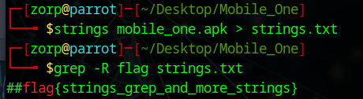

# Android CTF - Mobile One

Welcome to the Android Capture The Flag (CTF) based on the Mobile One application!

## Introduction

This CTF has been designed for the 2020 HacktivityCon, source code [here](https://github.com/MinistryOfPwning/ctfs/tree/master/2020/HacktivityCon/mobile/mobile-one).

## Prerequisites

- Android Studio
- The Android application mobile_one.apk downloaded from github

## Walkthrough

Through my experience in Mobile CTFs the first thing I would like to do is search for strings in the .apk file:

```strings -f mobile_one.apk```

The result being long we may try to grep any flag on it:



Flag: **flag{strings_grep_and_more_strings}**

## Video

[Walkthrought video of my work](https://youtu.be/xYtAZLwKJFY).