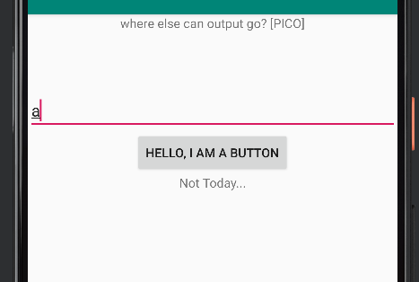
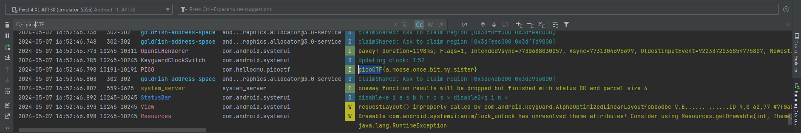
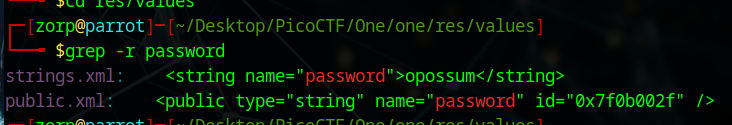

# Android CTF - picoCTF

Welcome to the Android Capture The Flag (CTF) based on the picoCTF Practice Challenges!

## Introduction

This CTF is an open source challenge published by picoctf, more informations [here](https://play.picoctf.org/practice?page=1&search=droids).

## Prerequisites

- Linux
- The Android applications .apk downloaded from picoCTF Website

## Walkthrough

As usual we do the unpackaging of the .apk file & search for strings.

The first things to do are to decode the app and search for flag strings:
```
apktool decode zero.apk
```

```
strings zero.apk > strings.txt
```
```
grep -r flag strings.txt 
```
Going to res/values
```
grep -r flag 
```

Gives us some hints, we see a "hint" name which we can search for later:

```
grep -r hint strings.xml 
```

It tells us to search somewhere else: "Where else could that be?"

As the reverse seemed very difficult (the code looks obfuscated), I decided to launch the application and see what happens.



If we open logcat and search for `picoCTF` strings, we get the following result:



We found the flag for level 0.

Flag1: **picoCTF{a.moose.once.bit.my.sister}**

Let's start with droid1 now: one.apk

When opening the apk, we have the same front page which asks us for a password.

After some research, I found that going to res/values and then use grep:
```
grep -r flag 
```

Gives us the following password



Sending the right password `opossum` gives us the flag:


Flag2: **picoCTF{pining.for.the.fjords}**

## Video

[Walkthrought video of my work](https://youtu.be/ityW3oIsM_g).
