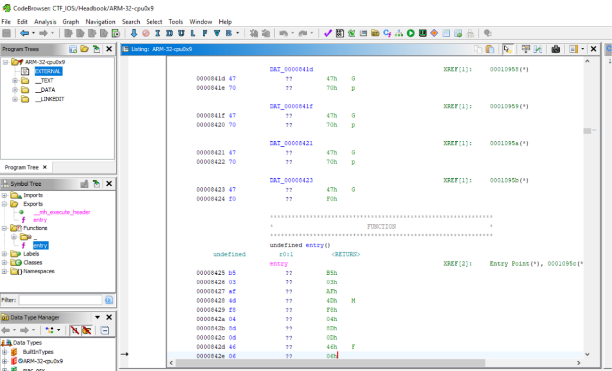

# iOS CTF - Headbook_v1.0

Welcome to the iOS Capture The Flag (CTF) based on the Headbook_v1.0 application!

## Introduction

This CTF has been designed by ivodriguez, more info [here](https://ivrodriguez.com/mobile-ctf/).

## Prerequisites

- iOS virtual machine
- The iOS application Headbook_v1.0 downloaded from github

## Walkthrough

First I unzipped the app using

```unzip -f Headbook-v1.0.ipa```

Then the first thing to do is to look at the .plist file for this I used plutil

```plutil -p Info.plist```

This can also be done by using Notepad++ even on Windows

We get two important informations from this file: Headbook is the main file binary of the application, and we also see a flag at the end:

```
<key>flag</key>
	<string>flag-EC840814-CEBA-4731-8620-CB991D850B14</string>

```

Flag 1: **flag-EC840814-CEBA-4731-8620-CB991D850B14**

To reverse our binary we can use Ghidra for exemple



And we can look for every strings in the resulted Swift code. For this we can either use Ghidra tool to do so or directly strings command on MacOS Terminal.

```
strings Headbook > strings.txt
grep -C 1 “flag” strings.txt
```


We see 4 occurrences of the word flag in our strings and two of them looks suspicious: _BD570736 seems to be a flag, also %@-%@-%@-%@-%@-%@- seems to be one but let’s make sure about the format.

We can either use Ghidra now or add more context (-C 5 for exemple) to understand better the behaviors of the word flag in our binary.

Walking in our file with Ghidra strings brings us to this:


We will consider this to be the second flag.

Flag 2: **flag-BD570736-D304-400A-A6B7**

In the same way, I used strings function in Ghidra to find this sequence: %@- and clicked on it to jump to its location in the binary file. We find this out:


In the same way we got a flag:

Flag 3: **flag-9861DA53-C08C-47C4-84D6-B48463AB738A**

Secondly, I looked at Assets.car which is the compiled file for the graphics assets of the application such as images, etc.

To do so I used acextract which is an open source tool especially made for this use.

After installing acextract, and decompiling Assets.car with

```
./acextract -i Assets.car -o Assets -v
```

We obtain a folder with the assets and bingo, we have an image named flag, after obtaining it we have the 3rd flag


Flag 4: **flag-2F110A91-4BAC-4A18-A680-A6C2987CC2C4**

After searching through files, it comes evident to watch out for the Main files of the app, and indeed we find two folders in which there are .nib files: one for the Launchscreen and one for the Main app.

Using strings on all files results to getting this result on one (BYZ-38.. .nib)


We found one more flag.

Update: I recorded another version using ibtool.py an opensource tool to work with .nib files.


Once again we find the flag

Flag 5: **flag-5932744F-4810-4A6C-BD8F-66FF3E115ED6**

## Video

[Walkthrought video of my work](https://youtu.be/GLyKAv9DVEw).