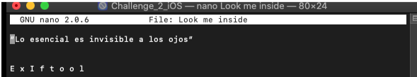
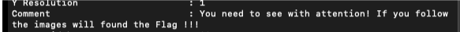
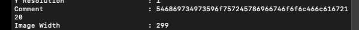
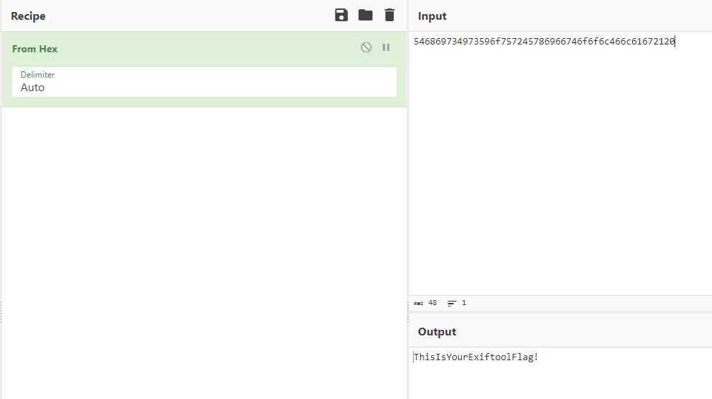

# iOS CTF - MHS-Challenge.

Welcome to the iOS Capture The Flag (CTF) based on the MHS-Challenge 2 application!

## Introduction

This CTF has been designed by justmobilesec, more info [here](https://github.com/justmobilesec/mhs-challenges-eko-2022/tree/main/challenges).

## Prerequisites

- iOS virtual machine
- The iOS application Challenge_2_IOS.ipa downloaded from github

## Walkthrough

First I unzipped the app using

```unzip -f Challenge_2_IOS.ipa```

Then, using ls we see a strange file named “Look me inside”

```
nano Look\ me\ inside
```




Then when we look at the files using exiftool we find out that there are comments on the metadatas:

```
exiftool -r -f superman.jpg
```



After a few research we find this:
```
exiftool -r -f ironman.jpg
```



We found the flag but still in hex format.

Hex flag:546869734973596f757245786966746f6f6c466c61672120

Using [CyberChef](https://gchq.github.io/CyberChef/#recipe=From_Hex('Auto')&input=NTQ2ODY5NzM0OTczNTk2Zjc1NzI0NTc4Njk2Njc0NmY2ZjZjNDY2YzYxNjcyMTIw) we find out the real flag from this Hex sequence:



Flag: **ThisIsYourExiftoolFlag!**

## Video

[Walkthrought video of my work](https://youtu.be/n23QO4trh24).